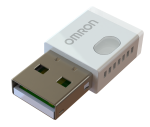
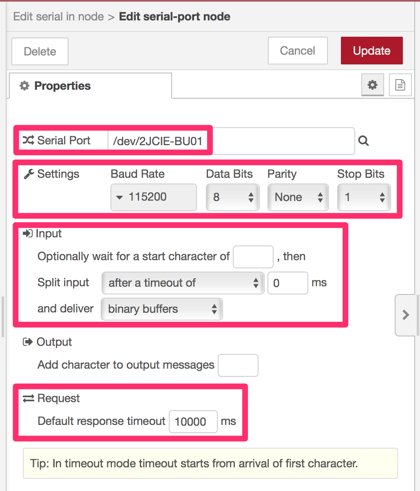

node-red-contrib-omron-2jcie-bu
===

[](https://github.com/CANDY-LINE/node-red-contrib-omron-2jcie-bu/releases/latest)
[](https://travis-ci.org/CANDY-LINE/node-red-contrib-omron-2jcie-bu/)

[`OMRON 2JCIE-BU` Environment Sensor (USB Type)](https://www.components.omron.com/product-detail?partId=73065) Serial Data Translator node.

**This node DOES NOT SUPPORT Bluetooth Communication Packets but DOES USB Serial Communication Packets.**



Supported sensor values are as follows.

1. Illuminance (lux)
1. Temperature (degree Celsius)
1. Humidity (%)
1. Barometric Pressure (hPa)
1. Sound Noise (dB)
1. eTVOC (ppb)
1. eCO2 (ppm)
1. Discomfort Index (DI, Temperature-Humidity Index)
1. Heat Stroke (degree Celsius)
1. Spectral Intensity Value (SI Value in cm/s=kine, for small to medium scale vibration)
1. Seismic Intensity Scale of Japan (for larger scale vibration like earthquake)
1. Vibration Status (`None`, `Vibration Detected`, or `Earthquake Detected`)
1. Mounting Position (see below)


`"Figure 20 Mounting orientation" 2JCIE-BU01 Environment Sensor (USB Type) User's Manual (A279), p.98`

This node project offers nodes translating the raw packets into easy-to-use JSON objects and vice-versa.

With `2JCIE-BU out` node, you can query sensor information by sending a command message object. You can set the LED color as well with the node.

With `2JCIE-BU in` node, you can get a JSON object from a raw data packet in response to a command.
The node supports Node-RED Dashboard [Chart node data format](https://github.com/node-red/node-red-dashboard/blob/master/Charts.md), which means you can quickly plot the device sensor data with the Chart node without any data transformation (available for numeric data).

## Where to buy OMRON 2JCIE-BU

Let's visit the [product page](https://www.components.omron.com/product-detail?partId=73065)!

## Example Flow

The bundled example flow provides the following demonstrations:

- `getLatestSensorData` inject node to send `getLatestSensorData` command
- `getMountingOrientation` inject node to send `getMountingOrientation` command
- `getMountingOrientation` inject node to send `getMountingOrientation` command
- `set LED Color (Light Blue)` inject node to send `setLED` command with Light Blue color number
- `set LED Color Rule (Temperature)` inject node to send `setLED` command with Temperature display rule

All outputs are shown on the debug tab.

# Prerequisites

## Software

The following node is required to send/receive data packets via USB serial.

* [node-red-node-serialport](https://flows.nodered.org/node/node-red-node-serialport) node
* Linux FTDI Driver (ftdi_sio.ko)

## Hardware

- OMRON 2JCIE-BU

## Supported OS

- Linux

## How to use

In order to use OMRON 2JCIE-BU, you might need some work as described below.

1. Add Product ID and Vendor ID to the FTDI Driver
1. Configure the `serial port` config node

### Add Product ID and Vendor ID to the FTDI Driver

Make sure `ftdi_sio.ko` is installed on the linux box and insert `OMRON 2JCIE-BU`.
Then Run the following commands in order to have the driver to detect `OMRON 2JCIE-BU` as a FTDI device.
And `/dev/ttyUSB[0-9]*` will be available.

```
$ sudo modprobe ftdi_sio
$ sudo chmod 777 /sys/bus/usb-serial/drivers/ftdi_sio/new_id
$ sudo echo 0590 00d4 > /sys/bus/usb-serial/drivers/ftdi_sio/new_id
```

### Configure the `serial port` config node

After starting your Node-RED, configure `serial port` config node.

- Choose Serial Port (typically `/dev/ttyUSB0`)
- Set 115200 for Baud Rate
- Choose `after a timeout of` input-split condition (timeout mode)
- Choose `binary buffers` for the delivery type
- Leave default timeout to 10 sec (10000ms)



# How to install

## Node-RED users

Use `Manage Palette` dialog in the browser editor or run the following commands:
```
cd ~/.node-red
npm install @candy-line/node-red-contrib-omron-2jcie-bu
```

Then restart Node-RED process.

### Uninstallation

```
cd ~/.node-red
npm uninstall @candy-line/node-red-contrib-omron-2jcie-bu
```

## CANDY RED users

Use `Manage Palette` dialog in the browser editor or run the following commands:
```
cd /opt/candy-red/.node-red
sudo npm install --unsafe-perm @candy-line/node-red-contrib-omron-2jcie-bu
```

Then restart `candy-red` service.

```
sudo systemctl restart candy-red
```

### Uninstallation

`Manage Palette` dialog should work for uninstallation as well as the following commands:

```
cd /opt/candy-red/.node-red
sudo npm uninstall --unsafe-perm @candy-line/node-red-contrib-omron-2jcie-bu
```

# Appendix

## How to build

```
# build
$ NODE_ENV=development npm run build
# package
$ NODE_ENV=development npm pack
```

# License

- Source Code ... ASL 2.0 ©CANDY LINE INC.

# Revision History

* 1.0.0
  - Initial Release
